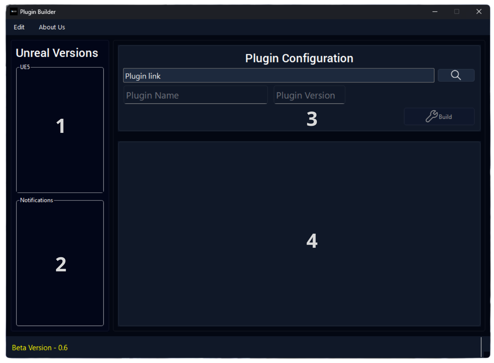
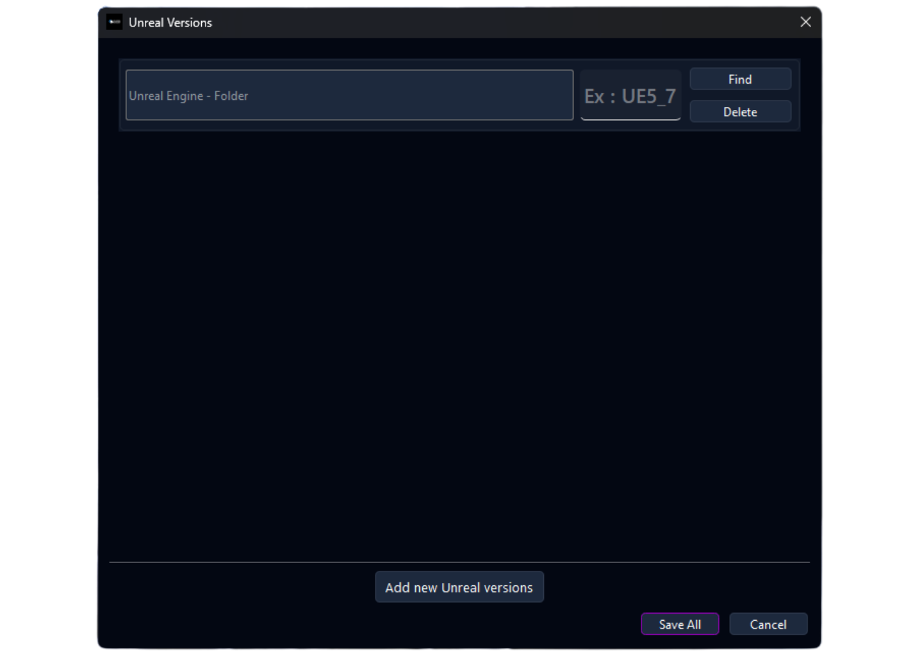
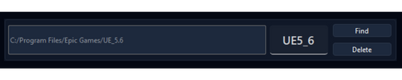
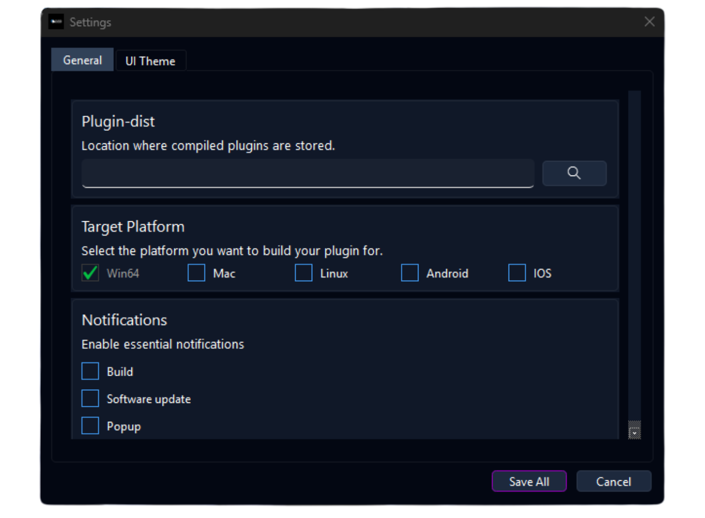

# 🇫🇷 PluginBuilder - Un Outil pour les Développeurs Unreal Engine

  

**PluginBuilder** est un outil de bureau puissant et léger, développé avec Qt/C++, conçu pour automatiser entièrement le processus de build, de packaging et d'exportation de vos plugins Unreal Engine. Que vous visiez une seule ou plusieurs versions du moteur, PluginBuilder simplifie votre flux de travail et génère des dossiers propres, prêts à être publiés sur le Marketplace Unreal (Fab).

## 📖 Table des matières

- [✨ Fonctionnalités Clés](#-fonctionnalités-clés)
- [🎯 Pourquoi PluginBuilder ?](#-pourquoi-pluginbuilder-)
- [🛠️ Construit Avec](#️-construit-avec)
- [📚 Utilisation](#-utilisation)
- [📄 Licence](#-licence)
- [📧 Contact](#-contact)

## ✨ Fonctionnalités Clés

- 🔧 **Builds automatiques** de plugins pour plusieurs versions d'Unreal Engine.
- 📦 **Pipeline de packaging complet** avec une sortie structurée.
- 🚀 **Export en un clic** prêt pour la publication sur Fab.
- 📁 **Organisation automatique** des dossiers de sortie.
- ⚙️ **Interface rapide, propre et conviviale** développée avec Qt.
- 🧩 Compatible avec tous les types de plugins (Blueprint, C++, hybride).

## 🎯 Pourquoi PluginBuilder ?

- **Gagnez un temps considérable** à chaque mise à jour de vos plugins.
- **Évitez les erreurs de build** et les manipulations manuelles.
- **Automatisez entièrement** votre flux de travail de publication.
- **Standardisez la sortie** de vos livrables pour Fab ou pour vos clients.

## 🛠️ Construit Avec

Ce projet utilise les technologies suivantes :

- 
- 
- 

## 📚 Utilisation

Une fois l'application lancée, vous serez accueilli par l'interface principale. Voici un guide détaillé de chaque section de l'application.

### 1. Fenêtre de Chargement (`LoadingWindow`)

Au lancement, une fenêtre de chargement apparaît. Elle affiche une barre de progression pendant que l'application initialise ses composants et charge les données nécessaires.

### 2. Fenêtre Principale (`MainWindow`)

C'est l'interface centrale de PluginBuilder.

- **Liste des Versions d'Unreal Engine ( 1 )** : Cette zone liste toutes les versions d'Unreal Engine que vous avez configurées. Cochez les cases des versions pour lesquelles vous souhaitez compiler votre plugin.

- **Sélection du Plugin ( 2 )** : Zone de notification qui s affiche sois apres build, mise a jour , ...

- **Boutons d'Action ( 3 )** :
    - `🔍︎` : Chercher le fichier `.uplugin` de votre plugin. 
    - `Plugin Name` : Nommé le nom de votre plugin.
    - `Plugin Version` : Nommé la version de votre plugin.
    - `Build` : Lance le processus de compilation et de packaging pour les versions sélectionnées.
    - `Edit` : Ouvre la fenêtre de d edition.
        - `Unreal Versions` : Ouvre la fenêtre de gestion des versions d'Unreal Engine.
        - `Settings` : Ouvre la fenêtre des paramètres.
    - `About Us` : Affiche des informations sur l'équipe de développement.
    - `Examples` : 
        - 
        - 

- **Zone de Log (4)** : Affiche en temps réel les journaux de build, les erreurs et les informations de statut. C'est ici que vous pouvez suivre tout le processus.

### 3. Gestion des Versions d'Unreal (`UnrealVersions`)

Cette fenêtre vous permet d'ajouter, de modifier ou de supprimer les installations d'Unreal Engine que PluginBuilder utilisera pour les builds.

- **Ajouter une nouvelle version** : Cliquez sur `Add new Unreal versions` pour ajouter une nouvelle entrée. Vous devrez fournir un nom et le chemin vers le dossier du moteuur Unreal (par exemple, `C:\Program Files\Epic Games\UE_5.4`).
- **Liste des Versions** : Affiche les versions déjà configurées. Chaque entrée montre le nom de la version (ex: "UE 5.4") et le chemin d'accès au moteur.
- **Sauvegarder/Annuler** : Utilisez les boutons en bas pour sauvegarder vos modifications ou annuler.
- `Example` : 
    - 

### 4. Fenêtre des Paramètres (`Settings`)

Cette section vous permet de personnaliser le comportement de l'application.

- **Onglet Général** :
  - **Plugin-dist** : Définissez le dossier de sortie où les plugins compilés seront stockés.
  - **Target Platform** : Sélectionnez les plateformes pour lesquelles vous souhaitez compiler (Win64, Mac, Linux, etc.). Notez que seule la plateforme sur laquelle vous exécutez l'application est officiellement supportée pour le moment.
  - **Notifications** : Activez ou désactivez les notifications pour certains événements (par exemple, la fin d'un build).
- **Onglet UI Theme** : Personnalisez l'apparence de l'application ( cette fonctionnalité peut être en cours de développement ).

### 5. Fenêtre "À Propos" (`AboutUs`)

Cette fenêtre affiche des informations sur l'équipe "Mecanes", avec des liens vers le Discord et la page du marketplace Unreal.

<!-- ## 🗺️ Roadmap

- [ ] Support des builds en parallèle
- [ ] Historique des logs de build
- [ ] Export automatique en format ZIP
- [ ] Présélections de builds personnalisées -->

## 📄 Licence

Ce projet est distribué sous la **Licence MIT**. Voir le fichier `LICENSE` pour plus d'informations.

## 📧 Contact

Github : [PluginBuilder](https://github.com/Mecanes-Org/PluginBuilder)

